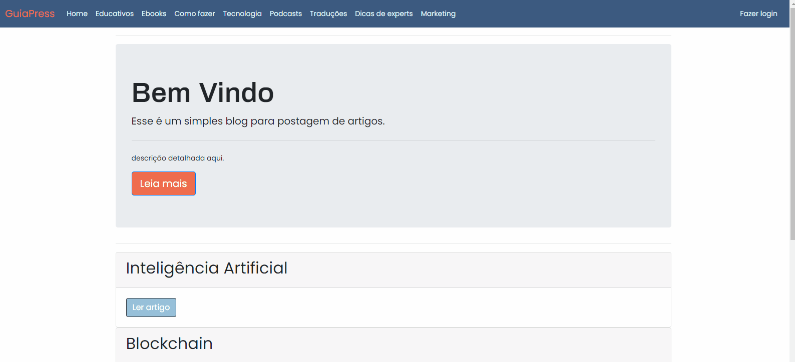

<h1 style="text-align: center; font-weight: bold;">Blog-GuiaPress</h1>

## Demo 📸

<div align="center" >
  
  
</div>

---

## Sobre o Projeto

arquitetura separada por (funcionalidade) semelhante a arquitetura mvc.
Este projeto foi desenvolido

_Realiconamento_
relacionamento

### 🛠 Tecnologias

As seguintes ferramentas foram usadas na construção do projeto:

- [bcryptjs](https://www.npmjs.com/package/bcrypt)
- [body-parser](https://www.npmjs.com/package/body-parser)
- [ejs](https://ejs.co/)
- [slugify](https://slugify.online/)
- [mysql2](https://www.npmjs.com/package/mysql2)
- [sequelize](https://sequelize.org/)
- [express-session](https://www.npmjs.com/package/express-session)
- [Express](https://expressjs.com/)
- [tiny](https://www.tiny.cloud/)

---

### Pré-requisitos

Antes de começar, você vai precisar ter instalado em sua máquina as seguintes ferramentas:
[Git](https://git-scm.com), [Node.js](https://nodejs.org/en/).
Além disto é bom ter um editor para trabalhar com o código como [VSCode](https://code.visualstudio.com/)

### 🎲 Rodando a Aplicação

```bash
# Clone este repositório
$ git clone https://github.com/cesaraugustomt/Blog-GuiaPress
# Acesse a pasta do projeto no terminal/cmd
$ cd Blog-GuiaPress

# Instale as dependências
$ yarn
# ou
$ npm install

# Execute a aplicação em modo de desenvolvimento
$ node index.js
# ou
$ nodemon index.js

# entre no link
http://localhost:3030/

```

Veja meu Linkedin: [Cesar Augusto](https://www.linkedin.com/in/cesar-augusto-6513551a4/)
